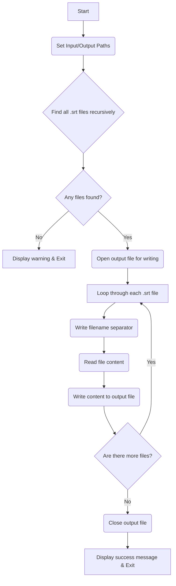
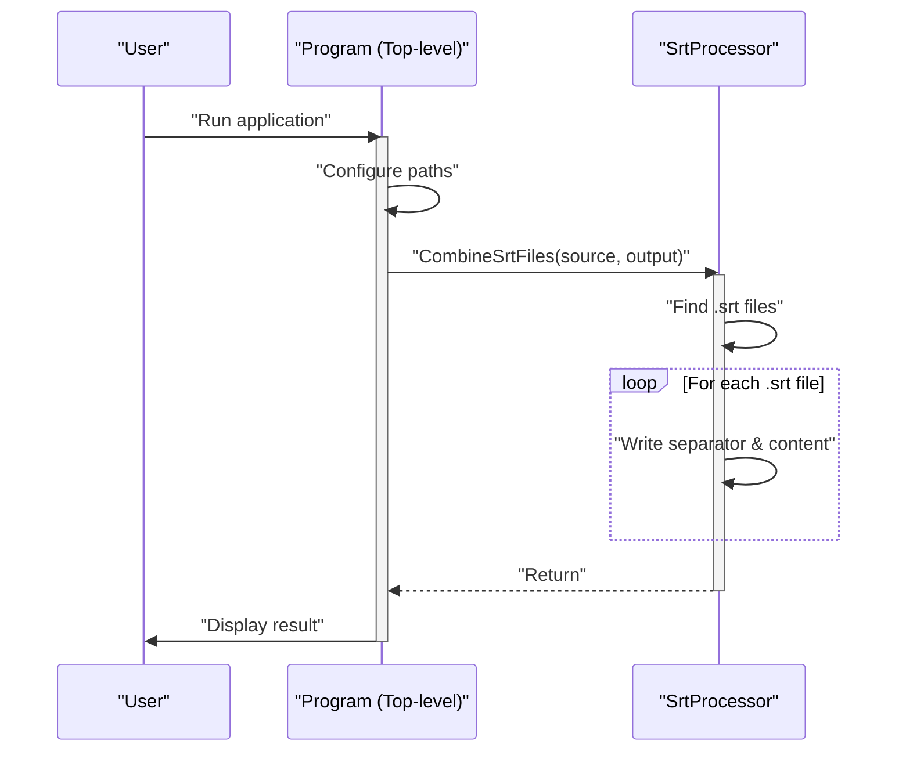

# SRT File Combiner

A simple and efficient .NET console application to recursively find all `.srt` (SubRip Subtitle) files in a specified directory and combine them into a single output file. Each original file's content is preceded by a separator indicating its source filename.

This tool is useful for consolidating subtitle data for analysis, archiving, or processing with Large Language Models (LLMs).

## Features

-   **Recursive Search:** Scans the source directory and all its subdirectories for `.srt` files.
-   **Content Separation:** Inserts a clear separator (`--- START OF: [filename] ---`) before the content of each file, making it easy to trace the origin of the data.
-   **UTF-8 Encoding:** Saves the final combined file with UTF-8 BOM encoding for maximum compatibility.
-   **Self-Contained Build:** Can be published as a self-contained application that runs on Windows without needing the .NET runtime installed.

## Workflow Visualization

To better understand how the application works, here are a few diagrams illustrating its structure and flow.

### Flowchart

This chart shows the step-by-step logic of the program from start to finish.

### Sequence Diagram

This diagram illustrates how the main program entry point interacts with the `SrtProcessor` class to perform the core task.

## Getting Started

### 1. Configuration

Before running the application, you need to configure the source and output paths.

1.  Open the `Program.cs` file.
2.  Locate the `CONFIGURATION` section at the top.
3.  Modify the `sourceFolderPath`